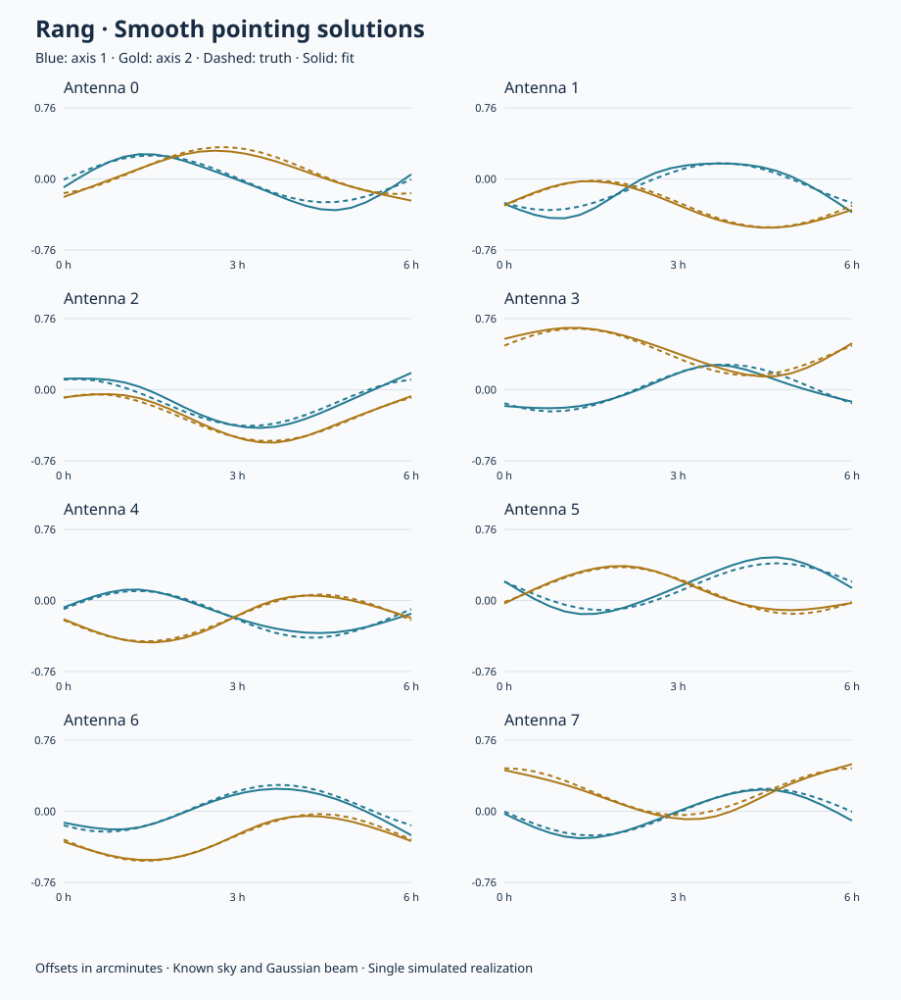

# Rang

**Radio Astronomy Next Generation · MeerKAT calibration research**

Reproducible experiments in direction-dependent calibration: recovering faint emission while accounting for uncertain telescope response. Rust provides the numerical core; Python provides research interfaces and experiment orchestration.

[Pointing solutions](research/pointing-solutions.md) · [Results](research/first-results.md) · [Research direction](research/novelty.md) · [Experiment guide](examples/README.md)

## Current research lead: a pointing–sky–gain ambiguity

**Practical solver convention:** following feedback from Oleg, use
`solve_pointing(..., zero_mean_pointing=True)` to solve pointing relative to
the array mean. The unweighted antenna mean is exactly zero in both axes at
every spline time. This removes the shared trajectory from the fit; it does
not establish that the telescope's physical mean pointing is zero. The
unconstrained option remains available for controlled identifiability tests.
With a fixed or restricted sky/gain model, imposing this convention can still
leave model mismatch when the true mean is nonzero; it is not a universal
visibility-preserving transformation for realistic beams.

[Relative-pointing recovery tests](research/relative-pointing.md) now compare
correct and biased sky models, with and without a physical shared offset.
Held-out time samples now show an approximately elevenfold reduction in clean
visibility prediction error versus gain/flux-only fitting in the matched toy.
The nonzero shared-offset control still fails the noise-level residual check.
[Public pointing-history inspection](research/pointing-history.md) records why
the historical measurements are not yet used as within-track drift models.

**Robustness check:** [beam, gain-flexibility, temporal and missing-source
stress tests](research/robustness-stress.md) now qualify the matched-model
result. A 1% beam-width error biases off-axis flux ratios by 0.53–0.76%; an
omitted 20 mJy source severely biases pointing. No state-of-the-art quality
or compute advantage has yet been demonstrated.

**A smooth pointing change of 35 arcseconds can leave the visibilities unchanged.**
We derived and tested an exact transformation of pointing, sky fluxes and
antenna gains for identical Gaussian beams—including rotating elliptical beams.
The two predictions agree to about 10⁻¹⁵ Jy in the finite test.

This revises our earlier interpretation: ellipticity restores information in
a restricted two-mode trajectory model, but not when the remaining shared
trajectory is free. Controlled non-Gaussian beam structure lifts the local
ambiguity only weakly. A central flux calibrator alone does not remove it;
additional non-collinear off-axis flux anchors do in the idealized audit.

[Exact transformation, controls and research implications →](research/gaussian-gauge.md)

A [katbeam-based follow-up](research/katbeam-pointing.md) tests a simplified
holography-informed beam. Its native chromatic shape gives local data-only
bounds near 8 arcsec in the toy; freezing the axis ratio worsens them to
100–120 arcsec. Beam uncertainty and joint nonlinear recovery remain pending.

The [information-budget diagnostic](research/information-budget.md) now
separates visibility-only constraints from uncertain, correlated external
flux priors. In the Gaussian toy, a 1% flux prior yields 6–7 arcsec local
uncertainties while the same pointing modes remain unconstrained by the
visibilities alone. These are local estimates, not nonlinear recovery results.

This is a concrete research result, **not a verified novelty claim or real-data
calibration demonstration**. The finite Gaussian ambiguity is tested exactly;
non-Gaussian and external-anchor results are local information audits.

The earlier [restricted-mode recovery and baseline-coverage results](research/beam-rotation.md)
remain documented with their assumptions. General information-mode truncation
did not improve pointing accuracy over a fairly tuned joint baseline; that
[negative result is retained](research/spectral-pointing.md).

## Smooth pointing-error solutions

The current focus is recovering **smoothly time-varying, per-antenna pointing offsets** from a component-list sky model. A JAX reference path provides direct Fourier prediction, automatic derivatives and cubic-spline pointing fits alongside the Rust baseline.

```sh
python3 -m venv .venv
.venv/bin/python -m pip install --index-url https://pypi.org/simple -e '.[pointing,test]'
.venv/bin/python examples/pointing.py --output outputs/pointing
```

The example holds out interior time samples and saves fitted trajectories, truth and prediction metrics. The first solver assumes a fixed, correct sky and Gaussian beam. [Model, API and limitations →](research/pointing-solutions.md)

Initial control: **2.0 arcsec trajectory RMSE**, with held-out residuals reduced from **2.64 to 0.95 mJy/component** against 1 mJy injected noise. One seed, not a robustness claim.

<details>
<summary>View per-antenna pointing trajectories</summary>



</details>

## First result

### Sky uncertainty and pointing recovery

The [latest 20-seed experiment](research/sky-uncertainty.md) introduces 2% source-flux errors. Fixed-sky calibration gives **30.24 arcsec** pointing RMSE; joint flux/pointing inference gives **2.48 arcsec**, close to the **2.40 arcsec** correct-sky control. Overly tight flux priors leave **28.19 arcsec** error. The solver now supports per-component flux uncertainty; positions, spectra and beam shape remain fixed.

### Beam-width control

**Preserving an injected signal does not establish accurate source flux.** In a controlled 20-seed experiment, a 2% beam-width error produces a 71% flux overestimate despite a 99.75% injection response. Fitting beam width resolves the bias when the true error belongs to the fitted model family.

| Joint calibration model | Recovered flux | Injection response | Held-out residual RMS |
|:--|--:|--:|--:|
| Sky + pointing, fixed beam width | 34.27 mJy | 99.75% | 11.71 mJy |
| Sky + pointing + beam width | 20.12 mJy | 99.99% | 9.98 mJy |

True source flux: **20 mJy**. Noise: **10 mJy per visibility component**. Values are means across seeds 1–20, not uncertainty intervals. [Full results and controls →](research/first-results.md)

## Quick start

Requires Rust with edition-2024 support and Python 3.10+. The Rust core has no external crate dependencies.

```sh
python3 -m venv .venv
.venv/bin/python -m pip install --index-url https://pypi.org/simple -e '.[plot,test]'
.venv/bin/python examples/toy.py --seeds 7 11 19 --beam-error 0.02 --output outputs/demo
```

The script builds the optimized Rust executable and writes JSON results and PNG/PDF plots. Without plotting dependencies, run `python3 examples/toy.py --no-plot`. See the [experiment guide](examples/README.md) for the Python API and metric definitions.

## Research direction

The active physical lead is the [symmetry-aware pointing audit](research/beam-rotation.md). The broader decision-rule proposal below remains a separate, unproven extension.

We are investigating **calibration-mode selection with separate signal-distortion and model-error contamination budgets**. A differential response test can miss an additive flux bias; the proposed second budget addresses sensitivity to plausible model errors.

Joint sky/beam inference is established prior work. The current adaptive protection prototype has **not** improved on ordinary joint fitting. The dual-budget extension is a specified hypothesis, not an implemented or validated new algorithm. Its [prior-art comparison and acceptance criteria](research/novelty.md) define what must be demonstrated before claiming a contribution.

## Scientific status

The simulator uses a scalar RIME with the full non-coplanar phase, a Gaussian primary beam and eight approximate MeerKAT core antenna positions. It fits pointing offsets, a faint extended-source amplitude and optionally shared beam width.

This is a controlled research demonstrator, **not an operational MeerKAT calibrator**. Verified full-array geometry, measured beams, uncertain bright-source spectra and imaging-domain validation remain outstanding. [Assumptions and provenance →](data/README.md)

## Repository guide

| Location | Contents |
|:--|:--|
| `src/` | Visibility simulation, analytic derivatives and calibration solvers |
| `python/rangtoy/` | Python interface to the Rust executable |
| `examples/` | Reproducible campaigns and comparison plots |
| `tests/` | Python integration and scientific regression tests |
| `research/` | Results, mathematical proposals and primary-source references |
| `data/` | Geometry provenance and limitations |

## Development

See [CONTRIBUTING.md](CONTRIBUTING.md) for local checks and research reporting standards. Retain negative results: a lower residual alone is not evidence of more faithful astronomy.
