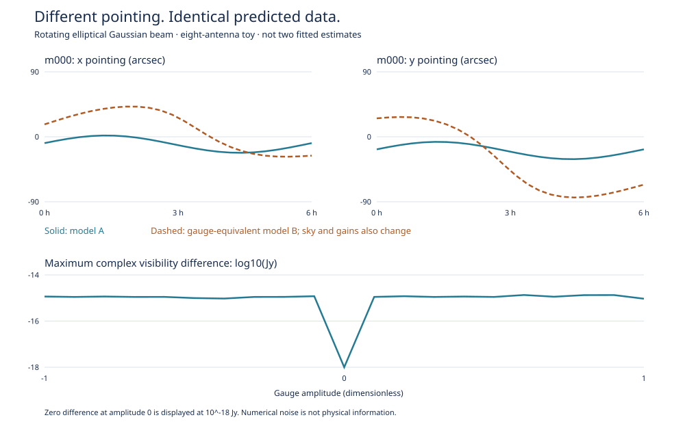

# A Gaussian pointing–sky–gain ambiguity

Gijs Molenaar · Rang research note · 11 September 2026 · Draft for technical review

[Short review brief](review-brief.md) · [Numerical results](results/gaussian-gauge.json)

## Result and correction to the earlier interpretation

**Ellipticity and rotation alone do not determine general absolute pointing
when the sky and antenna gains are free.** The earlier two-mode experiment
restricted the common trajectory to `R(t) a`. Freeing its temporal complement
reveals a different, smooth two-dimensional ambiguity. The earlier numerical
results are reproducible conditional results, not evidence that a general
pointing solver can measure those modes without additional information.

In a finite test, pointing trajectories differing by 34.95 arcsec RMS per
coordinate produce identical visibilities to a maximum difference of
9.31 × 10⁻¹⁶ Jy. This holds with nonzero differential pointing, non-unit
complex gains, a rotating ratio-1.1 Gaussian beam and the full w-term.
It is an algebraic symmetry, not a local optimizer failure.



The figure shows one antenna's two coordinates, not an estimated uncertainty
band. Model B is an exact transformation of model A, including its sky and
gains. The bottom panel samples 21 transformations from amplitude −1 to +1;
zero residual at amplitude zero is floored only for display.

## Exact transformation

The forward model is

```math
V_{pqt\nu}=g_{pt\nu}g_{qt\nu}^{*}
\sum_j I_{j\nu}E_{pjt\nu}E_{qjt\nu}
\exp\{-2\pi i\nu[c^{-1}(u l_j+v m_j+w(n_j-1))]\},
\qquad n_j=\sqrt{1-l_j^2-m_j^2}.
```

Here `u,v,w` are in metres, the beams are real positive voltage responses,
and `I` is integrated component flux. Sky positions are held fixed. The beam
uses tangent-plane pointing translations; retaining the exact w phase does
not make the beam model a full-sphere electromagnetic model.

Let the identical scalar voltage beams be

```math
E_{pjt\nu}=\exp[-\kappa_\nu(R_t s_j-d_{pt})^T Q(R_t s_j-d_{pt})],
\qquad Q=\operatorname{diag}(r,r^{-1}).
```

Here `s` is the two-vector of sky direction cosines, `d` is pointing in radians,
`R` rotates into the antenna frame, and the known positive-definite beam metric
`Q` is constant across antennas and channels. The Gaussian-core scale sets
`κ = 2 ln(2) / FWHM²`. For any constant two-vector `a` in radians, define

```math
h_t=Q^{-1}R_t a,\qquad d'_{pt}=d_{pt}+h_t,
```

```math
I'_{j\nu}=I_{j\nu}\exp[-4\kappa_\nu s_j^T a],
```

```math
g'_{pt\nu}=g_{pt\nu}\exp[2\kappa_\nu d_{pt}^TQh_t+
\kappa_\nu h_t^TQh_t].
```

Expanding the beam quadratic gives

```math
\frac{E'_{pjt\nu}}{E_{pjt\nu}}=
\exp[2\kappa_\nu s_j^T a-2\kappa_\nu d_{pt}^TQh_t-
\kappa_\nu h_t^TQh_t].
```

Multiplication by the transformed gain leaves `exp(2κ sᵀa)` per antenna.
The two antennas' factors cancel the transformed source flux exactly, source
by source and baseline by baseline. Fourier phases, including `w(n−1)`, are
unchanged. More baselines or lower noise cannot distinguish this family under
these assumptions. The transformation composes and is inverted by replacing
`a` with `−a` at the transformed model; regression tests verify that inverse.

**Proposition.** Within this scalar Gaussian model, for any admissible finite
`a`, the transformed parameters produce exactly the same complex visibility
at every sample. The expansion above is a constructive proof. It establishes
at least a two-dimensional ambiguity, not a classification of every null
direction of the full calibration problem.

For a likelihood depending on those predicted visibilities and a fixed noise
covariance, the likelihood is identical for *any* observed data, including
noisy data. Across the 21-point sweep, the largest prediction difference is
1.35 × 10⁻¹⁵ Jy. With independent 1 mJy real/imaginary noise (seed 72), χ² is
5424.231020291 and its numerical range is 7.01 × 10⁻¹¹. There are 5,376 real
samples; no parameters were fitted to that noise. This is not an optimization
benchmark or evidence that the parameters are physically equivalent.

The gain transformation is source independent but generally depends on time,
antenna and frequency. Free source/channel amplitudes are essential to the
stated symmetry. Known spectra, gain constraints, a beam metric that varies
between antennas/channels, or independent pointing information can change it.

More precisely, antenna-to-antenna Gaussian shape variation alone need not
remove the ambiguity if all per-antenna pointing trajectories are free. The
same algebra holds with `Q` replaced by `Q_pt` and
`h_pt = Q_pt⁻¹ R_t a`, provided this metric is independent of frequency after
factoring out the common `κ_ν`. The shift then differs between antennas.
This is an analytic corollary, **not an implemented heterogeneous-beam test**.
Frequency-dependent beam *shape*, as distinct from the usual common λ/D
scaling, is therefore a particularly relevant next control.

Smoothness alone does not exclude this family: `Q⁻¹R(t)a` is smooth whenever
the rotation is smooth. A particular low-order spline space may exclude the
exact family, but then any resulting constraint can depend on that choice.

At zero pointing the compensating gain change is second order in `a`.
Consequently, the local pointing/sky Jacobian has this null space even when
gains are fixed. A local null direction alone does not imply an exact finite
ambiguity with fixed gains; the finite proof above allows gains to change.

## What breaks it in the toy?

### Invariants and regularization

For identical metrics, pairwise differential offsets `d_pt − d_qt` are
unchanged by this particular transformation. Absolute common pointing and
the intrinsic sky brightness are not. These invariants do not prove that all
differential offsets are otherwise identifiable.

Adding a common log-flux scale `b_ν` gives the combined flux ambiguity

```math
\log I'_{j\nu}-\log I_{j\nu}=b_\nu-4\kappa_\nu s_j^T a.
```

The corresponding extra factor in each gain is `exp(−b_ν/2)`. For positive
flux anchors, the spatial design rows `[1, l_j, m_j]` must span three
dimensions to eliminate this scale-plus-tilt family at a channel. This
explains the central-plus-two-non-collinear anchor control. Three collinear
anchors leave a pointing ambiguity; a regression test verifies that case.

A proper prior can select a member of this family and make the posterior
well behaved. It does not turn the chosen gauge coordinates into independent
measurements. One useful diagnostic would report the likelihood information
separately from the prior contribution along the analytic gauge directions.
That diagnostic is a proposed next extension, not a completed solver feature.

### Controlled beam-shape perturbation

We added a controlled non-Gaussian voltage shape

```math
E=\exp(-z-\epsilon z^2),\qquad
z=\kappa_\nu(R_t s-d)^TQ(R_t s-d).
```

`ε` is a dimensionless shape coefficient, **not a percentage beam error**.
At nonzero `ε`, the nominal Gaussian FWHM is only a core scale. This is an
analytic stress test, not a measured MeerKAT beam or a claim about its shape.

The local audit uses all 2,688 complex rows of the eight-antenna toy, 1 mJy
noise per real component, free source/channel fluxes, 1,536 real gain columns,
336 differential-pointing columns and the 46-dimensional temporal complement
of the two target shared trajectories. All nuisance parameters have no prior.
The target coordinates are coefficients of `R(t)a`; after marginalizing the
complement these describe the corresponding projection of a general common
trajectory. The audit is evaluated at zero pointing and unit gains.

| Beam | Shape coefficient | Measurable target modes | Local coordinate bounds |
| --- | ---: | ---: | ---: |
| Circular | 0, 0.01 or 0.1 | 0 | Undefined |
| Rotating ratio-1.1 ellipse | 0 | 0 | Undefined |
| Rotating ratio-1.1 ellipse | 0.01 | 2 | 561, 586 arcsec |
| Rotating ratio-1.1 ellipse | 0.1 | 2 | 57.7, 60.0 arcsec |

The distinction is between mathematical rank and usable information. Even
when non-Gaussian structure lifts the null space, its information can be weak.
These are conditional local Fisher bounds, not measured estimator errors or
reliable large-displacement nonlinear uncertainty intervals. Beam shape is
known in this audit; fitting it could weaken the information further.

Applying the *Gaussian* finite transformation to a non-Gaussian beam changes
the prediction, including for the circular case with nonzero differential
pointing. That merely disproves this particular transformation there; it does
not establish global uniqueness. It does not contradict the circular local
null space at zero differential pointing.

## External flux anchors: a concrete control

With the Gaussian ellipse and all temporal/gain nuisances still free, fixing
the central source's flux in every channel does **not** remove either pointing
mode. The central direction has `s=0`, so its flux is unchanged by the gauge.
Adding one exactly known off-axis source removes one mode; adding a second
non-collinear off-axis source removes the other:

| Exactly known channel fluxes | Measurable target modes |
| --- | ---: |
| None | 0 |
| Central source only | 0 |
| Central + first off-axis source | 1 |
| Central + two non-collinear off-axis sources | 2 |

The last case gives idealized local bounds 0.090 and 0.186 arcsec, but assumes
**perfect external flux knowledge**. These numbers are not a practical accuracy
claim. Finite and potentially correlated flux uncertainties must be propagated.
The central anchor fixes the ordinary absolute flux-scale ambiguity as well;
the requirement should not be shortened to “any two known sources suffice.”

## Research significance and prior art

RIME calibration ambiguities are established; see
[Smirnov (2011), Section 1.5](https://arxiv.org/abs/1101.1765).
Joint sky/pointing/beam inference is also established in
[Lochner et al. (2015), BIRO](https://academic.oup.com/mnras/article/450/2/1308/981750).
The explicit transformation here is our derivation within that framework,
not a verified first-in-literature result or a new universal impossibility
theorem. It does not contradict pointing self-calibration with a known sky.

| Primary reference | Closest established result | Boundary of the present claim |
| --- | --- | --- |
| [Bhatnagar & Cornwell (2017), Sections 4 and 6](https://arxiv.org/abs/1709.08681) | Pointing SelfCal given a sky model, with simulation and on-sky tests | We vary the sky and gains jointly; this is not a refutation of known-sky pointing recovery |
| [Mouri Sardarabadi & Koopmans (2019)](https://arxiv.org/abs/1902.02482) | Calibration identifiability, Cramér–Rao bounds and baseline-subset effects | Rank projection and baseline-coverage warnings are not new methods |
| [Fannjiang & Chen (2018)](https://arxiv.org/abs/1806.02674) | Scaling and affine-phase ambiguities in blind ptychography | A related inverse-problem analogy, not an equivalent theorem: here the sky change is a real log-amplitude tilt and the data are complex visibilities |
| [de Villiers & Cotton (2022)](https://arxiv.org/abs/2202.02101) | Measured frequency-dependent MeerKAT L-band primary beams | Our Gaussian/quartic models are analytic controls, not measured beam fits |

Targeted searches and these primary sources establish close precedents, not
the absence of an earlier explicit Gaussian pointing transformation. Expert
review is needed before using “novel” in a paper or talk title.

The useful research question is now: **which measured departures from a
Gaussian beam constrain the otherwise ambiguous common pointing modes,
after realistic gain, trajectory, beam and sky uncertainties are allowed?**
The candidate workflow should expose those modes and distinguish information
from observations, external anchors and trajectory priors. It should not
interpret a convenient gauge choice or regularization optimum as a measurement.

The full finite symmetry test is implemented. The non-Gaussian and anchor
results are local audits, not a full nonlinear joint solver. No real telescope
data have been calibrated; the 27 MB measured-metrics download previously
failed with HTTP 502. The toy uses eight approximate MeerKAT positions, not
the complete array or a verified three-dimensional antenna survey.

## Reproduction

```sh
OPENBLAS_NUM_THREADS=1 .venv/bin/python examples/gaussian_gauge.py
```

Seed 61 specifies the same sky, smooth pointing and complex gains for the
finite controls. Six beam cases and four anchor cases are saved to
`outputs/gaussian-gauge/results.json`; the
[archived output](results/gaussian-gauge.json) includes all numerical results.
The exact transformation is `rangtoy.gauge.gaussian_gauge`; the local audit
options are `common_time_variation`, `beam_quartic` and `fixed_flux_sources`.

The output also includes the 21-point noisy-data sweep, figure coordinates,
Python/JAX/NumPy versions and SHA-256 hashes of the Rust binary, fixture and
four Python source files. Binary hashes can differ across platforms; source
and fixture hashes identify the scientific inputs. Floating-point residuals
and rank thresholds need not be bitwise identical across numerical libraries.

For a fresh checkout, create a virtual environment and install from public
PyPI as documented in the [README](../README.md). The figure is generated as
dependency-free SVG at `outputs/gaussian-gauge/gauge-orbit.svg`.
